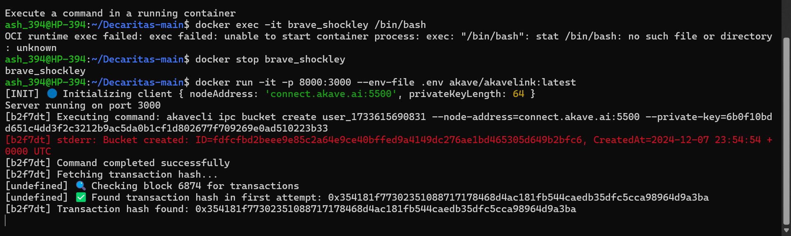
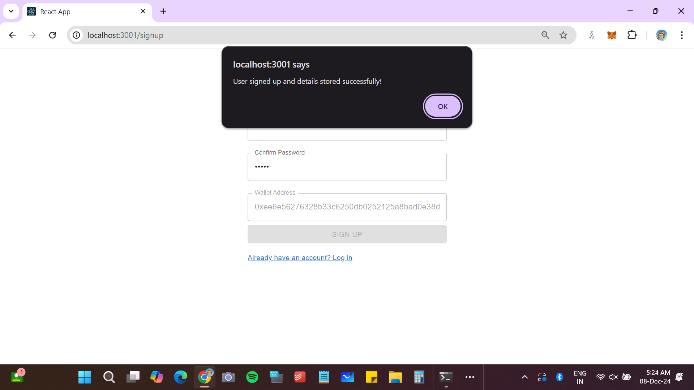

# .Arike: Connecting developers who've fallen in love with Coding

#### Citrea Contract deployment address: 0xe66fbe6b364b758c7560969d13993ac9568c5bb5
[Citrea Test Explorer](https://explorer.testnet.citrea.xyz/address/0xE66Fbe6b364b758c7560969d13993aC9568c5Bb5)

#### Used AKAVE for storing user data using docker container

.Arike is an innovative platform designed to help hackathon participants find teammates, collaborate effectively, and win by leveraging reputation-based matchmaking, decentralized storage, real-time collaboration tools, and privacy-preserving verification. It aims to simplify team creation and collaboration for hackathon participants by offering:

## Key Features:
1. **Skill-based Matchmaking**
2. **Gamified Rewards System**
3. **Privacy-preserving Verification with Anon Aadhaar**
4. **Decentralized User Data Storage via Akave**

With features like team formation, reputation scoring, real-time video calls, and AI-powered idea analysis (chatbot), .Arike transforms the way developers network and collaborate.

---

## Core Features

### 📝 Onboarding:
- **Wallet Sign-up**: Simple, blockchain-based onboarding via wallet authentication.

### 👤 Profile Setup:
- Add **skills**, **interests**, **proof of work**, and **preferences** to create a detailed hacker profile.

### 🔍 Matchmaking:
- **Skill-based Team Formation**: Find teammates using compatibility scores through a **swipe interface** or **search filters**.

### 🤖 **AI Chatbot Assistant**:
- The chatbot analyzes user input and generates suggestions about **tech stacks**, **sponsor-priority prize recommendations**, and **strategies** for hackathon ideas.

### 🔗 **Decentralized Storage**:
- **Akave + Filecoin-powered storage** for secure, privacy-preserving user data.

---

## Future Implementations

### 💬 Real-Time Chat & Collaboration:
- Integrated **Huddle01 video calls** and **chat support** for seamless communication.

### 🏆 **Gamified Rewards**:
- **Badges**, **leaderboard rankings**, and **reputation scores** to incentivize collaboration and competition.

---

## Advanced Features

### ✅ **Privacy with Anon Aadhaar Verification**:
- **Selective data-sharing mechanisms** ensure that users can verify themselves while maintaining privacy through **Anon Aadhaar**.

---

## 🚀 Usage

Once the app is live:

1. **Sign Up**: Register with your wallet.
2. **Complete Profile**: Add your **skills**, **interests**, and **proof of work**.
3. **Start Swiping**: Use the **compatibility-based matchmaking** to find your ideal teammates.
4. **Interact with AI Chatbot**: Receive personalized suggestions on **tech stacks**, **hackathon strategies**, and **prize recommendations**.

---

.Arike transforms the hackathon experience by using cutting-edge technology to streamline team formation, enhance collaboration, and provide privacy while enabling meaningful connections in the Web3 space.

